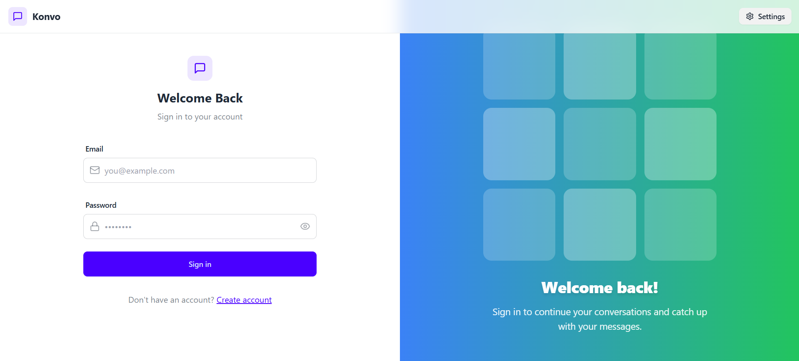

# Konvo 🗨️ – Real-Time Chat App

**Konvo** is a full-stack real-time chat application built using the **MERN stack** (MongoDB, Express, React, Node.js) and **Socket.IO** for live messaging. It is containerized using Docker and deployed on **Render** for seamless cloud accessibility.

---

## 🚀 Features

- 🔐 User Authentication (JWT-based)
- 💬 Real-time one-to-one messaging using **Socket.IO**
- 🌐 Fully containerized using **Docker & Docker Compose**
- 📁 Media uploads via **Cloudinary**
- 🗂️ MongoDB for persistent chat & user data
- 📦 Deployed to **Render**

---

## 🛠️ Tech Stack

- **Frontend:** React, Socket.IO Client
- **Backend:** Node.js, Express, MongoDB, Socket.IO
- **Database:** MongoDB
- **DevOps:** Docker, Docker Compose
- **Deployment:** Render
- **Other:** Cloudinary, bcryptjs, JWT, dotenv, cookie-parser

---

## 🐳 Dockerized Architecture

This project uses **Docker Compose** to orchestrate three services:

- `frontend`: React app served via NGINX or development server.
- `backend`: Node.js Express API with Socket.IO.
- `mongo`: MongoDB container with persistent volume.

### 📁 Project Structure

Konvo/
├── frontend/
├── backend/
├── docker-compose.yml
└── README.md

### 🐳 To Run Locally with Docker

```bash
# Clone the repository
git clone https://github.com/szaid47/konvo.git
cd konvo

# Build and run all services
docker-compose up --build

Then open your browser:

Frontend: http://localhost:5173

Backend API: http://localhost:5001/api

Note: You may need to configure .env files inside backend/ and frontend/.

```
📸 Screenshots


#### 🔐 Login Page
<p align="center">
  
</p>

#### 🔹 Schedule Page
<p align="center">
  
</p>


This project is licensed under the MIT License.
